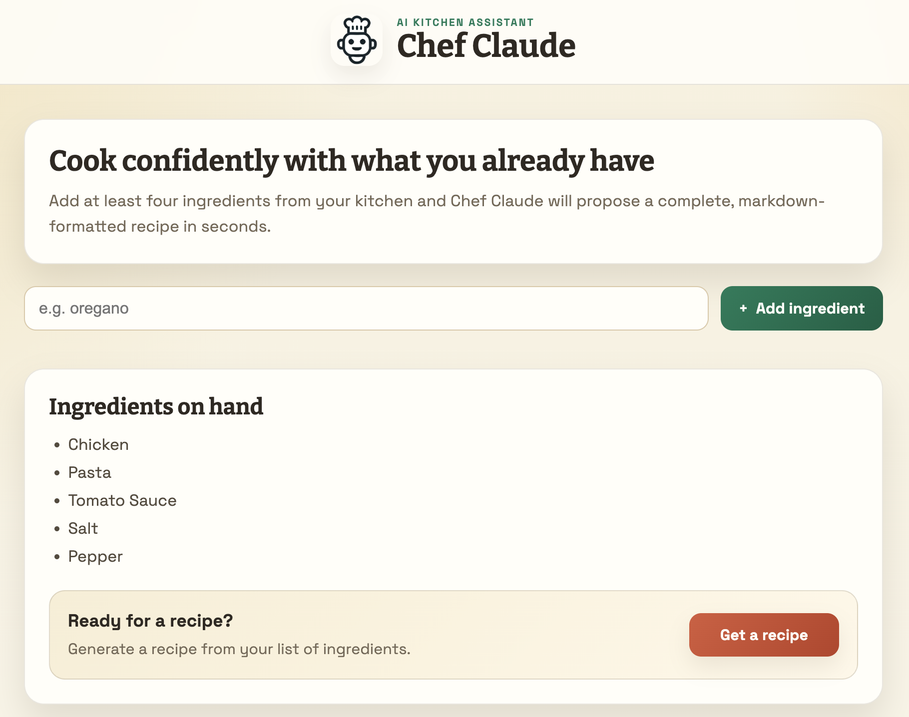
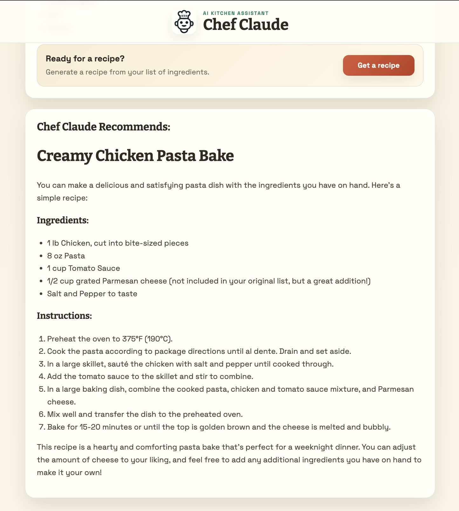

# 👨‍🍳 Chef Claude AI


An AI-powered recipe generator built with **React**, **Vite**, and the **Hugging Face Inference API**. Simply enter the ingredients you already have, and Chef Claude will generate a complete recipe in seconds using a large language model.

---

## 📸 Preview
<p align="center">
  
  
</p>

---

## 🚀 Live Demo

👉 **Try it here:**

https://yamankadoura.github.io/chef-claude-ai/


---

## ✨ Features

- 🤖 AI-powered recipe generation
- 🥘 Generate recipes from available ingredients
- 📝 Markdown formatted recipes
- ➕ Add ingredients dynamically
- 🚫 Prevent duplicate ingredients
- ⏳ Loading state while AI generates recipes
- ⚠️ Friendly error handling
- 🎨 Modern responsive interface
- 📱 Mobile-friendly design
- ♿ Accessibility improvements
- ⚡ Fast performance with Vite

---

## 🛠 Technologies

- React
- Vite
- JavaScript (ES6+)
- CSS3
- Hugging Face Inference API
- React Hooks
- React Markdown

---

## 📂 Project Structure

```text
chef-claude-ai/
│
├── assets/
│   ├── screenshot1.png
│   └── screenshot2.png
│
├── public/
│
├── src/
│   ├── components/
│   │   ├── ClaudeRecipe.jsx
│   │   ├── Header.jsx
│   │   └── IngredientsList.jsx
│   │
│   ├── images/
│   │   └── chef.png
│   │
│   ├── services/
│   │   └── ai.js
│   │
│   ├── App.jsx
│   ├── Main.jsx
│   └── index.jsx
│
├── .github/
│   └── workflows/
│       └── deploy.yaml
│
├── .env.example
├── .gitignore
├── eslint.config.js
├── index.css
├── index.html
├── package.json
├── package-lock.json
├── README.md
└── vite.config.js
```

---

## 💻 Getting Started

Clone the repository:

```bash
git clone https://github.com/yamankadoura/chef-claude-ai.git
```

Navigate into the project:

```bash
cd chef-claude-ai
```

Install dependencies:

```bash
npm install
```

---

## 🔑 Environment Variables

This project requires a Hugging Face API key.

Create a `.env` file in the project root:

```env
VITE_API_KEY=your_huggingface_api_key
```

> **Note:** The `.env` file is ignored by Git and should never be committed.

---

## ▶️ Run Locally

Start the development server:

```bash
npm run dev
```

Open your browser:

```text
http://localhost:5173
```

---

## 📦 Build for Production

```bash
npm run build
```

Preview the production build:

```bash
npm run preview
```

---

## 🤖 How It Works

1. Add ingredients from your kitchen.
2. Once you have at least four ingredients, click **Get a Recipe**.
3. Your ingredients are sent to the **Hugging Face Inference API**.
4. A large language model generates a complete recipe in Markdown.
5. The recipe is rendered beautifully inside the application.

---

## 🚀 Future Improvements

- ❤️ Favorite recipes
- 📋 Copy recipe to clipboard
- 📄 Download recipe as PDF
- 🛒 Shopping list generator
- 🌍 Multiple language support
- 🌙 Dark mode
- 🎙️ Voice input
- 🍽️ Dietary preferences (Vegan, Keto, Gluten-Free, etc.)
- 📸 Generate an AI image of the finished dish

---

## 📄 License

This project is licensed under the MIT License.